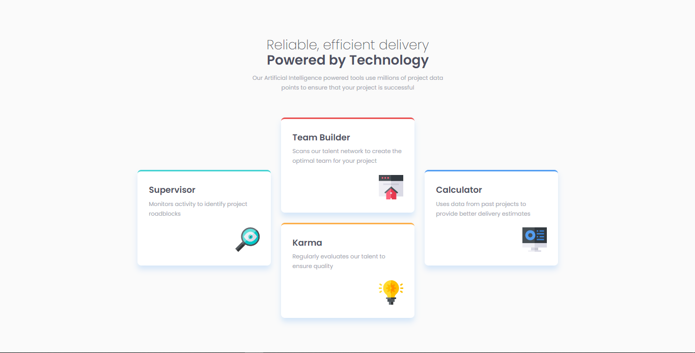

# Frontend Mentor - Four card feature section solution

This is a solution to the [Four card feature section challenge on Frontend Mentor](https://www.frontendmentor.io/challenges/four-card-feature-section-weK1eFYK) using CSS Grid

## Table of contents

- [Overview](#overview)
  - [The challenge](#the-challenge)
  - [Screenshot](#screenshot)
  - [Links](#links)
- [My process](#my-process)
  - [Built with](#built-with)
- [Author](#author)

## Overview

### The challenge

Users should be able to:

- View the optimal layout for the site depending on their device's screen size

### Screenshot

### Links

- Solution URL: [View my solution on frontend mentor]( https://www.frontendmentor.io/solutions/four-card-feature-section-solution-using-css-grid-and-bem-model-7uEDfRo1na)
- Live Site URL: [View live site on vercel](https://four-card-feature-section-iyhn.vercel.app/)

## My process

### Built with

- Semantic HTML5 markup
- CSS custom properties
- Flexbox
- CSS Grid
- Desktop-first workflow

## Author

- Website - [Ovie Nathaniel On LinkedIn](https://www.linkedin.com/in/ovie-nathaniel/)
- Frontend Mentor - [@ovie-best](https://www.frontendmentor.io/profile/ovie-best)
- Twitter - [@oviebest_2](https://twitter.com/oviebest_2)

